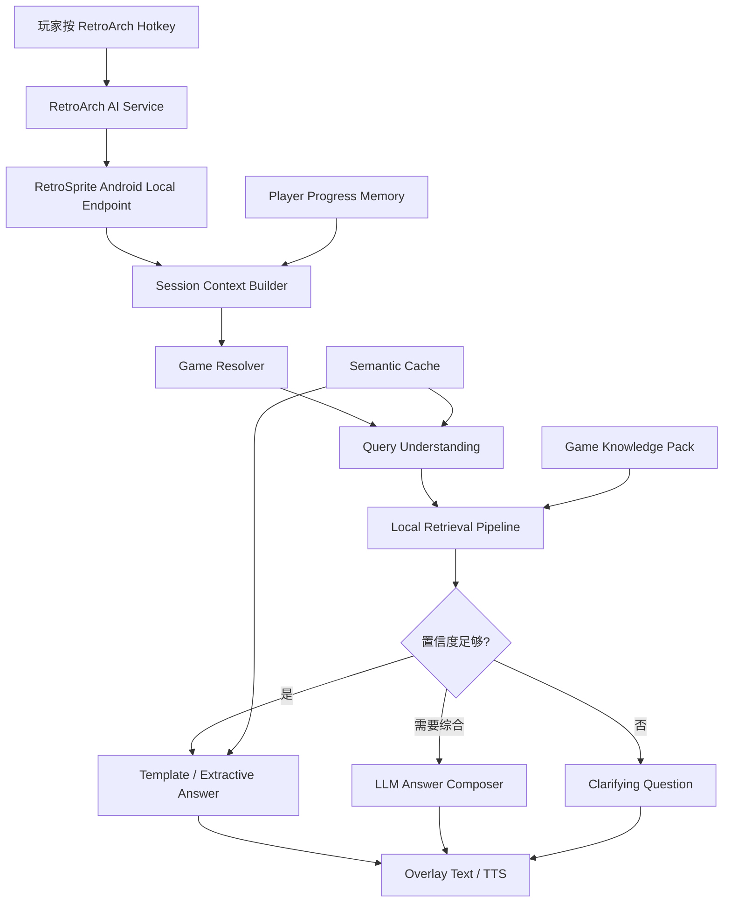
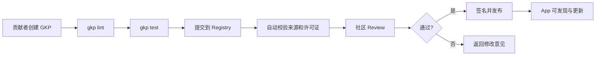
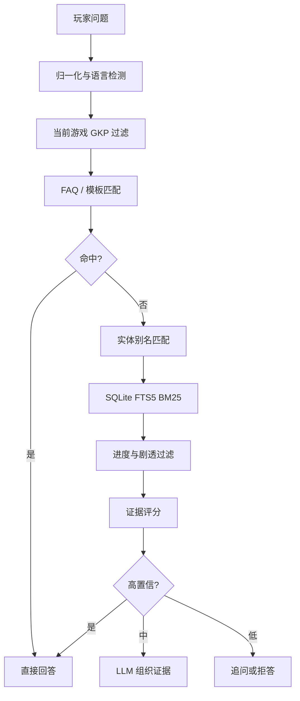

# RetroSprite 开发方案

版本：v0.1  
日期：2026-05-18  
状态：方案草案，不包含应用代码  
项目目录：`/Users/kartz/Development/Sprite`

## 1. 一句话定位

RetroSprite 是一个接入 RetroArch 的游戏内问答伙伴。玩家在复古游戏过程中按下快捷键，用文字或语音提问，RetroSprite 基于当前游戏、当前画面、玩家进度和本地 Game Knowledge Pack 给出准确、低剧透、可引用来源的回答。

核心不是“攻略提示器”，而是：

> 在 RetroArch 里随叫随到、真正懂当前游戏的低剧透问答伙伴。

## 2. 核心判断

### 2.1 应该做什么

RetroSprite 应优先做三个能力：

1. **RetroArch AI Service endpoint**
   - 利用 RetroArch 已有截图与 AI Service 请求机制。
   - 避免第一版陷入 Android `MediaProjection`、无障碍服务、悬浮窗权限和应用商店政策风险。

2. **Game-grounded Q&A**
   - 回答必须绑定当前游戏、版本、画面、OCR、进度和可信资料。
   - LLM 只负责组织语言、消歧、解释和翻译，不作为事实来源。

3. **Game Knowledge Pack 生态**
   - 每个游戏一个可安装、可更新、可验证、可本地检索的知识包。
   - 支持社区贡献，但必须有 schema、来源、许可证、测试题、签名和信任等级。

### 2.2 不应该先做什么

第一阶段不做这些：

- 不做全局 Android 悬浮 AI 助手。
- 不做实时自动监听和主动打断式提示。
- 不做“所有游戏都能答”的通用大模型产品。
- 不做 AI 自动控制 RetroArch 的存档、读档、输入操作。
- 不把互联网实时搜索作为主路径。
- 不在 GKP 中允许执行脚本或任意代码。
- 不以 Live2D、宠物动画、复杂皮肤作为 MVP 核心。

## 3. 目标用户与使用场景

### 3.1 目标用户

| 用户 | 典型设备 | 痛点 | RetroSprite 价值 |
|---|---|---|---|
| Android 复古掌机玩家 | Retroid、Odin、AYN、Android 手机 | 玩游戏时切浏览器查攻略很破坏节奏 | 游戏内按一下直接问 |
| JRPG 玩家 | RetroArch SNES/GBA/PS1 core | 地名、NPC、任务链、道具位置复杂 | 低剧透、按进度回答 |
| 日文/英文游戏玩家 | 原版 ROM、粉丝汉化版 | 看不懂台词或术语 | OCR + 翻译 + 游戏术语解释 |
| 社区内容贡献者 | GitHub / Web 后台 | 攻略分散，难复用 | GKP 标准化贡献 |
| 高级玩家/速通玩家 | PC/Android RetroArch | 需要精确机制、弱点、路线 | 来源可追踪、版本可区分 |

### 3.2 高频问题类型

| 类型 | 示例 | 回答策略 |
|---|---|---|
| 下一步去哪 | “我现在卡在这个村子，该去哪？” | 结合截图/OCR、章节、地点、低剧透提示 |
| 道具位置 | “Moon Stone 在哪？” | 实体检索 + 进度过滤 + 位置模板 |
| NPC 对话解释 | “这个 NPC 是什么意思？” | OCR + 术语表 + 低剧透解释 |
| Boss 机制 | “这个 Boss 怕什么？” | Boss 实体卡 + 阶段过滤 |
| 翻译 | “这句日文翻译一下” | OCR + 游戏术语映射 + 简短翻译 |
| 系统机制 | “这个状态怎么解除？” | 机制条目 + 道具/技能关联 |
| 版本差异 | “美版和日版这里一样吗？” | region / rom_hash 过滤 |
| 不剧透追问 | “告诉我方向，别说结局” | spoiler_level 控制 |

## 4. 产品原则

1. **玩家主动触发**
   - 默认不主动打断玩家。
   - 热键或悬浮按钮触发问答。

2. **短回答优先**
   - 默认 1-3 句。
   - 长解释进入展开面板。
   - 语音播报只读最短答案。

3. **低剧透优先**
   - 默认 `light`。
   - 玩家可以选择“更明确”或“直接答案”。

4. **证据优先**
   - 有来源、有进度、有版本约束才回答。
   - 证据不足时追问，而不是猜。

5. **本地优先**
   - 本地检索、本地缓存、本地索引。
   - LLM 调用只用于少量需要生成的请求。

6. **生态优先**
   - App 是入口，GKP 是长期资产。
   - 工具链要便于社区贡献、审核、更新和回归测试。

## 5. 总体架构



### 5.1 主要模块

| 模块 | 职责 | MVP 必须 |
|---|---|---|
| RetroArch Endpoint | 接收 AI Service 请求、截图、游戏信息 | 是 |
| Game Resolver | 根据 label、文件名、ROM hash 匹配 GKP | 是 |
| Context Builder | 组合截图 OCR、玩家问题、历史进度、剧透设置 | 是 |
| Query Understanding | 判断问题意图、语言、实体候选、是否需检索 | 是 |
| Retrieval Pipeline | 本地 FTS、别名匹配、进度过滤、来源排序 | 是 |
| Answer Policy | 决定直接答、调用 LLM、追问或拒答 | 是 |
| LLM Adapter | OpenAI-compatible BYOK 接口 | 是 |
| Overlay UI | 展示短回答、来源、追问按钮 | 是 |
| TTS/ASR | 语音输入输出 | Phase 3 |
| GKP Manager | 安装、校验、更新知识包 | Phase 2 |
| Registry Client | 从社区 registry 获取 GKP | Phase 4 |

## 6. RetroArch 集成策略

### 6.1 为什么优先 RetroArch AI Service

优先接 RetroArch AI Service 的原因：

- RetroArch 已支持将游戏截图发送到外部 AI endpoint。
- 能降低 Android 权限、悬浮窗、屏幕录制和应用商店合规复杂度。
- 与 RetroArch 玩家心智一致：配置 endpoint、按热键、获取响应。
- 可先在本地 HTTP endpoint 验证完整链路。

### 6.2 MVP 集成目标

MVP 只需要完成：

- Android App 在本机启动一个仅本地访问的 endpoint。
- RetroArch AI Service 指向该 endpoint。
- 玩家按热键后，RetroSprite 能收到请求。
- RetroSprite 能识别当前游戏，展示一个问答入口。
- 玩家输入问题后，RetroSprite 返回短文本。

### 6.3 暂不做的集成

- 暂不依赖 Accessibility Service。
- 暂不使用 MediaProjection 持续采集。
- 暂不通过 UDP 控制 RetroArch。
- 暂不自动暂停、存档、读档或操作输入。

## 7. Android App 设计

### 7.1 技术方向

| 层 | 建议 |
|---|---|
| 语言 | Kotlin |
| UI | Jetpack Compose |
| 存储 | SQLite / Room |
| 本地全文检索 | SQLite FTS5 |
| 网络 | 本地 HTTP server + BYOK LLM client |
| 后台任务 | WorkManager |
| 语音 | Android SpeechRecognizer / TextToSpeech 起步 |
| 日志 | 本地可导出 debug bundle |

### 7.2 App 内主要页面

| 页面 | 功能 |
|---|---|
| Home | endpoint 状态、RetroArch 配置指引、最近游戏 |
| Ask Overlay | 当前问题、回答、来源、追问按钮 |
| Game Packs | 已安装 GKP、版本、语言、信任等级 |
| Pack Detail | 来源、测试结果、覆盖范围、更新日志 |
| Settings | LLM provider、API Key、剧透等级、语言、语音 |
| Diagnostics | endpoint 连接测试、RetroArch 请求日志、索引状态 |

### 7.3 游戏中交互

默认流程：

1. 玩家按 RetroArch AI Service 热键。
2. RetroSprite 收到截图和游戏上下文。
3. 弹出简短输入框：“想问什么？”
4. 玩家输入文字，或后续版本使用语音。
5. RetroSprite 返回短答案。
6. 答案下方提供：
   - “更明确”
   - “少剧透”
   - “朗读”
   - “查看来源”
   - “这不对”

## 8. Game Knowledge Pack 标准

### 8.1 GKP 定义

Game Knowledge Pack 是一个针对特定游戏、平台、区域和版本的标准化知识包。它包含结构化知识、来源引用、别名、剧透图、测试问题和可选索引，但不包含 ROM、不包含商业攻略全文、不包含可执行代码。

### 8.2 设计原则

1. **数据包，不是插件**
   - 禁止可执行脚本。
   - 禁止动态加载代码。

2. **知识和索引分离**
   - 上传者贡献结构化数据。
   - 设备安装时可重新生成索引。

3. **来源可追踪**
   - 每条事实必须能追到来源。
   - 来源可为 manual、wiki、walkthrough、玩家笔记、社区验证。

4. **进度与剧透是核心字段**
   - 每条知识都应标注可见阶段和剧透等级。

5. **可测试**
   - 每个包必须包含 golden questions。
   - 更新后必须跑回归测试。

### 8.3 推荐包结构

```text
game-name-platform-region.gkp
├─ manifest.json
├─ knowledge/
│  ├─ entities.jsonl
│  ├─ locations.jsonl
│  ├─ quests.jsonl
│  ├─ mechanics.jsonl
│  ├─ bosses.jsonl
│  └─ dialogue_notes.jsonl
├─ sources/
│  ├─ citations.jsonl
│  └─ licenses.md
├─ spoiler_graph.json
├─ aliases.json
├─ qa_goldens.jsonl
├─ changelog.md
└─ index/
   └─ optional_prebuilt_index
```

### 8.4 Manifest 字段

| 字段 | 必填 | 说明 |
|---|---:|---|
| schema_version | 是 | GKP schema 版本 |
| pack_id | 是 | 全局唯一包 ID |
| game_title | 是 | 游戏标题 |
| platform | 是 | SNES / GBA / PS1 等 |
| region | 是 | US / JP / EU / CN hack 等 |
| rom_hashes | 建议 | SHA1/CRC 等，用于精确匹配 |
| languages | 是 | 支持语言 |
| spoiler_policy | 是 | progressive / explicit / unrestricted |
| license | 是 | 知识包许可证 |
| authors | 是 | 作者或社区 |
| source_policy | 是 | 来源要求 |
| trust_level | 是 | local / community / verified / official |
| created_at | 是 | 创建日期 |
| updated_at | 是 | 更新日期 |

### 8.5 实体字段

| 字段 | 说明 |
|---|---|
| entity_id | 稳定 ID，例如 `item:moon_stone` |
| entity_type | item / npc / boss / location / quest / mechanic |
| canonical_name | 标准名称 |
| aliases | 多语言名、错拼、民间译名、缩写 |
| description_short | 一句话描述 |
| progress_gate | 可见阶段 |
| spoiler_level | light / clear / full |
| related_entities | 关联 NPC、地点、道具、任务 |
| source_refs | 来源引用 |
| confidence | verified / community / uncertain |
| answer_templates | 可零 LLM 直接回答的问题模板 |

### 8.6 来源字段

| 字段 | 说明 |
|---|---|
| source_id | 稳定来源 ID |
| source_type | manual / wiki / walkthrough / player_note / test |
| title | 来源标题 |
| url | 来源链接，可选 |
| license | 来源许可证或使用说明 |
| author | 来源作者 |
| captured_at | 抓取或整理日期 |
| excerpt_policy | 是否允许短摘录 |
| reliability | high / medium / low |

### 8.7 剧透等级

| 等级 | 含义 | 示例 |
|---|---|---|
| light | 只给方向，不给完整解法 | “你应该再调查镇北区域。” |
| clear | 给明确地点或操作 | “去镇北遗迹入口和守卫对话。” |
| full | 完整答案，可能包含剧情或谜题解法 | “完成 X 后 Y 会背叛队伍，然后开启 Z。” |

### 8.8 信任等级

| 等级 | 含义 | 可见策略 |
|---|---|---|
| local | 用户本地导入，未经社区验证 | 默认可用，标注本地 |
| community | 社区上传，通过 schema 校验 | 可下载，显示风险 |
| verified | 通过测试、多用户验证、来源检查 | 推荐下载 |
| official | RetroSprite 团队维护或深度审核 | 默认推荐 |

## 9. GKP 工具链

### 9.1 必备工具

| 工具 | 用途 | 阶段 |
|---|---|---|
| gkp init | 创建知识包骨架 | Phase 2 |
| gkp lint | schema、来源、断链、剧透字段检查 | Phase 2 |
| gkp build | 生成本地索引 | Phase 2 |
| gkp test | 运行 golden questions | Phase 2 |
| gkp diff | 对比两个版本的内容变化 | Phase 3 |
| gkp sign | 生成签名和校验信息 | Phase 4 |
| gkp publish | 发布到 registry | Phase 4 |

### 9.2 上传与审核流程



### 9.3 Registry 功能

MVP 后期需要一个轻量 registry：

- pack 搜索。
- pack 元数据展示。
- 版本历史。
- changelog。
- SHA256 校验。
- 签名验证。
- 信任等级。
- 兼容游戏版本。
- 下载统计。
- 举报与下架机制。

## 10. 知识获取与构建流程

### 10.1 来源类型

| 来源 | 优点 | 风险 |
|---|---|---|
| 官方 manual | 准确、合法性较好 | 信息不完整 |
| Wiki | 结构化程度高 | 版本差异、许可证复杂 |
| Walkthrough | 覆盖流程细节 | 可能剧透重、版权风险 |
| Speedrun notes | 机制准确 | 不适合普通玩家 |
| 玩家笔记 | 贴近真实卡点 | 需要审核 |
| 汉化/术语表 | 翻译体验好 | 版本碎片化 |

### 10.2 内容处理步骤

1. 收集候选来源。
2. 记录来源许可证和链接。
3. 清洗正文，只保留允许使用的短事实、结构化条目和引用。
4. 抽取实体：地点、道具、NPC、Boss、任务、机制。
5. 建立别名：英文、日文、中文、缩写、错拼、民间译名。
6. 标注进度门槛和剧透等级。
7. 建立 answer templates。
8. 编写 golden questions。
9. 运行 lint 和 test。
10. 人工抽查高频问题。
11. 发布为 GKP。

### 10.3 内容质量标准

一个可发布的 GKP 至少应满足：

- 覆盖 50 个以上高频问题。
- 覆盖主要地点、道具、Boss、NPC。
- 每条关键事实有来源。
- 低剧透答案比例不低于 60%。
- golden questions 通过率不低于 90%。
- 不包含 ROM、商业攻略全文或不可授权复制内容。

## 11. 检索与回答策略

### 11.1 总体原则

检索管线应尽可能本地化和分层，避免每次提问都调用 LLM。



### 11.2 检索阶段

| 阶段 | 是否调用 LLM | 说明 |
|---|---:|---|
| 问题归一化 | 否 | 大小写、符号、常见错拼、多语言别名 |
| 游戏过滤 | 否 | 只搜当前游戏知识包 |
| FAQ/template | 否 | 高热门问题零成本回答 |
| 实体匹配 | 否 | item、boss、npc、location |
| SQLite FTS5 | 否 | BM25 排序、snippet |
| 向量检索 | 可选 | 处理模糊语义问题 |
| 重排 | 可选 | 可先本地规则，后续小模型 |
| LLM 生成 | 是 | 只在需要综合、解释、翻译时 |

### 11.3 回答决策

| 检索结果 | 动作 |
|---|---|
| FAQ 高置信命中 | 直接模板回答 |
| 单一实体高置信 | 使用实体 answer_template |
| 多个证据一致 | LLM 组织简短答案 |
| 多个候选冲突 | 追问玩家确认版本/地点 |
| 结果涉及高剧透 | 降级回答或提示玩家确认 |
| 结果低置信 | 明确说不确定，不编造 |

### 11.4 缓存策略

缓存 key 应包含：

- game_id
- pack_version
- normalized_question
- detected_location
- progress_gate
- spoiler_level
- language

缓存类型：

| 类型 | 用途 |
|---|---|
| Exact cache | 完全相同问题直接返回 |
| Semantic cache | 相似问题复用答案 |
| Retrieval cache | 缓存 top-k 检索结果 |
| OCR cache | 同一截图或相邻截图复用 OCR |
| Session memory | 当前游玩会话短期记忆 |

## 12. LLM 使用策略

### 12.1 BYOK 模式

MVP 使用 BYOK：

- 用户自带 OpenAI-compatible API Key。
- 支持 OpenAI、DeepSeek、兼容服务。
- App 不承担推理服务器成本。
- 默认提示用户成本风险和隐私边界。

### 12.2 何时调用 LLM

只在以下场景调用：

- 多段证据需要综合成短答案。
- 需要翻译 OCR 文本并结合游戏术语。
- 玩家追问“为什么”或“解释一下机制”。
- 检索结果有轻微歧义，需要消歧。
- 需要把答案改写为低剧透版本。

不应调用的场景：

- FAQ 命中。
- 单一实体位置问题。
- Boss 弱点、道具效果这类结构化事实。
- 置信度低到无法回答。

### 12.3 生成约束

LLM prompt 策略应包含：

- 只基于提供证据回答。
- 不知道就说不确定。
- 默认低剧透。
- 答案不超过 3 句，除非玩家要求展开。
- 输出来源引用 ID。
- 不提供未请求的后续剧情。
- 不暴露系统 prompt 或内部评分。

### 12.4 模型分级

| 任务 | 模型建议 |
|---|---|
| 短答案组织 | 低成本文本模型 |
| 翻译 + 术语解释 | 中低成本文本模型 |
| 截图理解 | 可选 Vision 模型，非主路径 |
| 长解释 | 用户显式展开后再调用 |
| 本地离线模式 | 后续探索小模型 |

## 13. 进度记忆与剧透控制

### 13.1 玩家进度来源

| 来源 | 可靠性 | MVP |
|---|---:|---|
| 玩家手动选择章节 | 高 | 是 |
| OCR 检测地点/任务文本 | 中 | 是 |
| 最近问答历史 | 中 | 是 |
| 存档解析 | 高但复杂 | 否 |
| 模拟器内存读取 | 高但侵入 | 否 |

### 13.2 进度模型

每个游戏维护一个 progress graph：

- chapter
- location
- quest stage
- unlocked entities
- hidden entities
- hard spoilers

玩家默认状态：

- 未知进度时，按最保守策略回答。
- 如果问题可能剧透，先确认。
- 用户可以手动设置“我已经到第 X 章”。

### 13.3 剧透交互

回答默认提供三档：

| 按钮 | 行为 |
|---|---|
| 轻提示 | 只给方向 |
| 更明确 | 给地点或操作 |
| 直接答案 | 给完整解法 |

## 14. 语音策略

### 14.1 阶段规划

Phase 1 只做文字。Phase 3 再加入语音。

### 14.2 语音输入

优先方案：

- Android 系统 SpeechRecognizer。
- 可选云端 ASR。
- 支持按住说话，避免误触发。

### 14.3 语音输出

优先方案：

- Android TextToSpeech。
- 默认只朗读短答案。
- 长答案只展示文字。
- 支持关闭语音。

### 14.4 语音设计原则

- 不打断游戏音效太久。
- 不朗读来源和长段解释。
- 默认一句话。
- 可通过“展开”查看更多。

## 15. MVP 范围

### 15.1 MVP 必须完成

| 模块 | MVP 要求 |
|---|---|
| RetroArch endpoint | 可接收 AI Service 请求 |
| 手动提问 | 文本输入 |
| 游戏识别 | label / 文件名 / 可选 hash |
| GKP 安装 | 内置 2-3 个实验包 |
| 本地检索 | SQLite FTS5 + alias |
| 答案生成 | 模板回答 + BYOK LLM 组织 |
| 来源展示 | 至少显示来源名称或 source_id |
| 剧透控制 | 默认 light，支持更明确 |
| 设置 | API Key、默认语言、剧透等级 |
| 诊断 | endpoint 状态、请求日志、索引状态 |

### 15.2 MVP 选择游戏

建议用三类游戏验证 schema：

| 类型 | 选择标准 | 验证能力 |
|---|---|---|
| JRPG | 任务、NPC、道具复杂 | 章节、低剧透、流程问答 |
| 动作冒险 | 地图、谜题、Boss | 地点识别、谜题答案分级 |
| 宝可梦类 | 实体、属性、版本差异 | 大量实体、别名、版本过滤 |

不必一开始选最热门游戏。优先选资料清晰、版权风险可控、社区熟悉、问题多样的游戏。

### 15.3 MVP 验收指标

| 指标 | 目标 |
|---|---:|
| endpoint 请求成功率 | 95%+ |
| 已知游戏识别准确率 | 95%+ |
| golden questions 答对率 | 85%+ |
| 默认回答平均延迟 | 2 秒内，本地命中 |
| LLM 调用占比 | 30% 以下 |
| 低剧透误伤率 | 5% 以下 |
| 用户可完成首次配置 | 10 分钟内 |

## 16. 分阶段计划

### Phase 0：协议验证

周期：1-2 周  
目标：证明 RetroArch AI Service 到 Android endpoint 的链路可行。

任务：

- 确认 RetroArch Android AI Service 请求格式。
- 建立本地 endpoint。
- 收到截图和 label。
- 返回固定文本。
- 编写配置指引。
- 在至少一台 Android 设备或模拟器上验证。

验收：

- RetroArch 按热键后能触发 RetroSprite 响应。
- RetroSprite 能记录请求日志。
- 用户能按文档完成配置。

### Phase 1：问答 MVP

周期：4-6 周  
目标：实现当前游戏内的文字问答。

任务：

- Compose 基础 UI。
- BYOK provider 设置。
- 文本提问界面。
- Game Resolver。
- SQLite FTS5 检索。
- alias 表。
- answer policy。
- template answer。
- LLM answer composer。
- 来源展示。
- 调试日志。

验收：

- 支持至少 2 个实验 GKP。
- 50 个 golden questions 通过率 85%+。
- FAQ 和实体问题可零 LLM 回答。

### Phase 2：GKP v0 标准与工具链

周期：4-5 周  
目标：把知识包从内置数据升级为可维护标准。

任务：

- 定义 GKP schema v0。
- 实现 lint 规则。
- 实现 build index 流程。
- 实现 test golden questions。
- 完成 3 个实验 GKP。
- 编写贡献指南。

验收：

- 新游戏知识包可由 schema 创建。
- 更新知识包可跑自动测试。
- App 可安装和重建索引。

### Phase 3：语音、缓存和体验打磨

周期：3-4 周  
目标：让掌机场景体验自然。

任务：

- 语音输入。
- TTS 短播报。
- semantic cache。
- OCR cache。
- “更明确 / 少剧透 / 查看来源 / 这不对”交互。
- 错误状态和离线状态。
- UI 响应式适配横屏。

验收：

- 常见重复问题可缓存返回。
- 语音回答不超过默认长度。
- 用户能在游戏中完成连续追问。

### Phase 4：Registry 与社区贡献

周期：6-8 周  
目标：建立 GKP 生态基础。

任务：

- Pack registry 元数据服务。
- Pack 搜索和下载。
- 签名验证。
- trust level。
- changelog 和 diff。
- 社区上传流程。
- 举报和下架机制。

验收：

- 用户可从 registry 安装 GKP。
- verified pack 可校验签名。
- 上传包必须通过 lint/test。

### Phase 5：高级能力

目标：增强但不影响核心稳定性。

候选能力：

- Vision LLM 场景理解。
- 离线小模型。
- 本地 embedding。
- RetroArch UDP 辅助控制。
- Live2D / Lottie 小精灵。
- 多设备同步。
- Web 版 GKP 编辑器。

## 17. 测试策略

### 17.1 测试类型

| 类型 | 覆盖 |
|---|---|
| Unit tests | query normalization、alias、spoiler filter |
| Integration tests | endpoint、retrieval、LLM adapter |
| Golden tests | GKP 问答回归 |
| Device tests | Android 横屏、后台、网络、本地服务 |
| UX tests | 配置流程、游戏中提问、追问 |
| Cost tests | LLM 调用比例、缓存命中率 |
| Safety tests | 剧透泄漏、低置信拒答、来源缺失 |

### 17.2 Golden Questions

每个 GKP 必须包含：

- 高频位置问题。
- 高频 Boss 问题。
- 低剧透问题。
- 直接答案问题。
- 翻译问题。
- 版本差异问题。
- 易混淆实体问题。
- 不应回答的问题。

测试输出至少检查：

- 是否答对核心事实。
- 是否引用正确来源。
- 是否符合 spoiler_level。
- 是否没有编造。
- 是否语言正确。

### 17.3 人工 QA 脚本

每个版本手动验证：

1. RetroArch 配置 endpoint。
2. 启动游戏并触发 AI Service。
3. 提问一个 FAQ。
4. 提问一个实体位置。
5. 提问一个模糊问题。
6. 提问一个高剧透问题。
7. 查看来源。
8. 使用“更明确”追问。
9. 关闭网络后验证本地命中。
10. 切换另一个游戏验证 resolver。

## 18. 安全、隐私与合规

### 18.1 隐私原则

- 默认本地处理。
- API Key 仅存在设备本地安全存储。
- 明确提示用户截图可能发送给外部 LLM provider。
- 支持关闭截图发送，只用 OCR/文本问题。
- 日志默认不包含完整 API Key。

### 18.2 GKP 安全

- GKP 不允许可执行代码。
- 安装前校验 schema。
- verified / official pack 使用签名。
- 显示来源和许可证。
- 支持用户删除 pack 和清除索引。

### 18.3 版权边界

- 不包含 ROM。
- 不分发商业攻略全文。
- 对来源做 license 记录。
- 尽量使用结构化事实、短引用、链接和原创整理。
- 对争议内容支持下架。

### 18.4 Android 权限策略

MVP 尽量只使用必要权限：

- 网络访问。
- 本地前台服务或通知，视 endpoint 运行方式决定。
- 语音阶段再引入麦克风权限。
- 不使用无障碍服务作为 MVP 依赖。
- 不使用持续屏幕录制作为 MVP 依赖。

## 19. 指标体系

### 19.1 产品指标

| 指标 | 含义 |
|---|---|
| first_success_time | 用户从安装到第一次成功问答的时间 |
| ask_per_session | 每次游玩会话提问次数 |
| answer_helpful_rate | “有帮助”反馈比例 |
| spoiler_complaint_rate | 剧透投诉比例 |
| source_open_rate | 用户查看来源比例 |
| followup_rate | 连续追问比例 |

### 19.2 技术指标

| 指标 | 含义 |
|---|---|
| endpoint_success_rate | RetroArch 请求成功率 |
| local_hit_rate | 本地零 LLM 命中比例 |
| llm_call_rate | LLM 调用比例 |
| p50_latency / p95_latency | 回答延迟 |
| cache_hit_rate | 缓存命中率 |
| retrieval_confidence | 检索置信度分布 |
| golden_pass_rate | GKP 回归测试通过率 |

## 20. 风险与应对

| 风险 | 影响 | 应对 |
|---|---|---|
| RetroArch AI Service 行为在平台间不一致 | 集成复杂 | Phase 0 先验证 Android 真机 |
| GKP 构建成本高 | 内容生态慢 | 先做 3 个样板包和工具链 |
| 版权不清 | 发布风险 | 强制来源/许可证，避免全文复制 |
| 答案幻觉 | 信任崩塌 | 证据不足追问，LLM 只基于证据 |
| 剧透泄漏 | 用户体验差 | spoiler graph + 默认 light |
| LLM 成本高 | 用户流失 | 本地检索、模板、缓存、BYOK |
| 配置复杂 | 新手放弃 | App 内配置向导和诊断页 |
| 社区包质量不稳 | 生态变脏 | lint、golden tests、trust level |
| 多语言别名混乱 | 检索不准 | aliases 作为一等数据 |
| 截图识别不准 | 上下文误判 | 不把视觉识别作为唯一事实来源 |

## 21. Issue 拆分建议

### 21.1 Phase 0 Issues

- 调研 RetroArch AI Service 请求/响应格式。
- 建立 Android 本地 endpoint 方案。
- 编写 RetroArch 配置文档。
- 实现请求日志设计。
- 真机验证 checklist。

### 21.2 Phase 1 Issues

- 定义 app settings 信息架构。
- 设计 Ask Overlay 交互。
- 设计 Game Resolver 规则。
- 设计 GKP 内置数据读取。
- 设计 SQLite FTS5 表结构。
- 设计 alias 归一化规则。
- 设计 answer policy。
- 设计 BYOK provider 配置。
- 设计来源展示格式。
- 建立 MVP golden questions。

### 21.3 Phase 2 Issues

- 定义 GKP schema v0。
- 定义 spoiler graph 规范。
- 定义 source refs 规范。
- 定义 qa_goldens 规范。
- 设计 gkp lint 规则。
- 设计 gkp build 输出。
- 设计 gkp test 报告。
- 编写贡献指南。

### 21.4 Phase 3 Issues

- 设计语音输入流程。
- 设计 TTS 短回答规则。
- 设计 semantic cache。
- 设计 session memory。
- 设计用户反馈按钮。
- 设计横屏 UI。

### 21.5 Phase 4 Issues

- 设计 registry 元数据模型。
- 设计 pack 签名和校验。
- 设计 trust level 审核流程。
- 设计 pack 搜索和下载。
- 设计 pack 更新 diff。
- 设计举报和下架流程。

## 22. 推荐目录规划

仓库未来可以按以下逻辑组织。这里只是规划，不代表现在创建代码目录。

```text
retrosprite/
├─ app-android/
├─ gkp-spec/
├─ gkp-tools/
├─ packs/
│  ├─ samples/
│  └─ verified/
├─ registry/
├─ docs/
├─ tests/
│  ├─ golden/
│  └─ fixtures/
└─ research/
```

## 23. 决策记录

| 决策 | 原因 |
|---|---|
| 优先 RetroArch AI Service | 降低 Android 权限和模拟器改造难度 |
| 产品从提示转向问答 | 玩家主动提问更自然，更有伙伴感 |
| GKP 标准化 | 长期护城河在知识包生态 |
| 本地检索优先 | 降低 LLM 成本，提高速度和准确性 |
| BYOK 起步 | 降低服务器成本和运营复杂度 |
| GKP 禁止执行代码 | 安全、审核和生态可控 |
| 默认低剧透 | 尊重游戏体验，区别于普通攻略站 |

## 24. 参考资料

### 24.1 官方与生态

- RetroArch AI Service：<https://docs.libretro.com/guides/ai-service/>
- RetroArch Network Control Interface：<https://docs.libretro.com/development/retroarch/network-control-interface/>
- Android MediaProjection：<https://developer.android.com/reference/android/media/projection/MediaProjectionManager>
- Google Play Accessibility policy：<https://support.google.com/googleplay/android-developer/answer/10964491>

### 24.2 文献

- Retrieval-Augmented Generation：<https://arxiv.org/abs/2005.11401>
- Dense Passage Retrieval：<https://arxiv.org/abs/2004.04906>
- Self-RAG：<https://arxiv.org/abs/2310.11511>
- Corrective RAG：<https://arxiv.org/abs/2401.15884>
- RAPTOR：<https://arxiv.org/abs/2401.18059>
- Ragas：<https://arxiv.org/abs/2309.15217>

### 24.3 高星项目参考

- RetroArch：<https://github.com/libretro/RetroArch>
- SQLite FTS5：<https://www.sqlite.org/fts5.html>
- FAISS：<https://github.com/facebookresearch/faiss>
- Qdrant：<https://github.com/qdrant/qdrant>
- Meilisearch：<https://github.com/meilisearch/meilisearch>
- Typesense：<https://github.com/typesense/typesense>
- Tantivy：<https://github.com/quickwit-oss/tantivy>
- GPTCache：<https://github.com/zilliztech/GPTCache>
- RAGFlow：<https://github.com/infiniflow/ragflow>

## 25. 下一步建议

建议下一步只做两件事：

1. **冻结 Phase 0 验证目标**
   - 明确要验证的 RetroArch AI Service 输入输出。
   - 明确 Android 真机环境。
   - 明确 endpoint 成功标准。

2. **选择 3 个实验游戏**
   - 一个 JRPG。
   - 一个动作冒险。
   - 一个宝可梦类或实体密集型游戏。

这两件事完成后，再开始写代码会更稳。否则很容易先做出一个“能聊天但不懂游戏”的壳。
