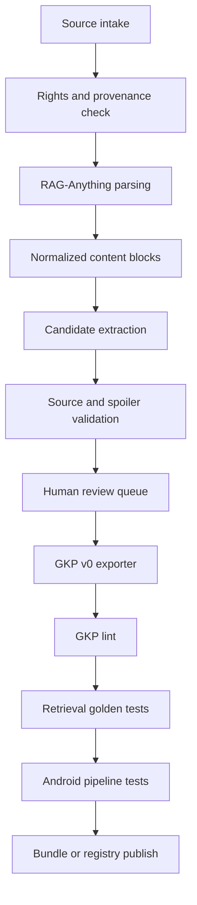

# RetroSprite RAG-Anything GKP Production Tooling Plan

> Date: 2026-05-19
> Status: implementation plan
> Scope: use RAG-Anything as an offline Game Knowledge Pack production tool, not as the Android runtime retriever.
> Related docs: `GKP_V0_SCHEMA.md`, `NEXT_IMPLEMENTATION_PLAN.md`, `TEST_COVERAGE.md`

## 1. Decision

RetroSprite should use RAG-Anything as a developer-side GKP factory.

It should not be embedded into the Android app and should not replace the current local Room/FTS5 retrieval path. The Android app remains Kotlin, local-first, low-latency, inspectable, and evidence-gated. RAG-Anything belongs in an offline build pipeline that helps parse messy source material and generate reviewed GKP candidate data.

Recommended boundary:

```text
RAG-Anything
  -> parse and analyze source material on a development machine
  -> produce draft structured knowledge
  -> export GKP v0 files
  -> run RetroSprite lint and golden tests
  -> ship plain data only

RetroSprite Android
  -> install validated GKP data
  -> resolve current game
  -> query local aliases/templates/FTS
  -> answer with citations and spoiler policy
```

## 2. Why This Fits RetroSprite

RetroSprite's current bottleneck is not whether the app can call an LLM. The app already has a Q&A pipeline, sample GKP import, Room/FTS5 retrieval, answer policy, and OpenAI-compatible BYOK adapter. The next real bottleneck is producing high-quality, low-spoiler, source-cited GKP content without hand-writing every row.

RAG-Anything helps with:

- parsing PDFs, images, Office documents, Markdown, and text files into a structured content list;
- extracting tables, figures, captions, OCR text, and context windows;
- running multimodal analysis before GKP export;
- indexing a local workbench corpus for authoring and review;
- generating first-pass entities, aliases, templates, source candidates, and QA goldens.

RetroSprite should keep:

- GKP as pure data, not executable plugins;
- GKP v0 schema as the public contract;
- local FTS/template/entity retrieval as the runtime default;
- low-spoiler answer policy as a non-negotiable rule;
- human review before any generated pack is bundled or distributed.

## 3. Goals

1. Build a repeatable `gkp-builder` toolchain that uses RAG-Anything to turn approved source material into draft GKP v0 packages.
2. Reduce manual GKP authoring time while increasing source coverage, alias coverage, and golden test coverage.
3. Keep every generated knowledge row traceable to a source id and locator.
4. Prevent copied long-form walkthrough text, ROM data, executable code, and unreviewed LLM claims from entering GKP packages.
5. Produce packs that pass existing Android-side parser, lint, retrieval, and answer policy tests.
6. Make the pipeline useful for `sample-2048` first, then one guide-heavy classic game and one mechanics-heavy game.

## 4. Non-Goals

- Do not ship RAG-Anything or Python inside the Android APK.
- Do not query RAG-Anything live during gameplay.
- Do not create a cloud dependency for core Q&A.
- Do not treat LLM output as a factual source.
- Do not ingest ROMs, BIOS files, commercial guidebook dumps, or copyrighted walkthrough copies.
- Do not generate final GKP data without a deterministic lint step and at least one human review checkpoint.
- Do not relax `GKP_V0_SCHEMA.md` just to fit RAG-Anything output.

## 5. Reference Inputs

RAG-Anything reference snapshot inspected for this plan:

- repository: `https://github.com/HKUDS/RAG-Anything`
- version: `1.3.0`
- commit: `146828f73de652c9d72399bfc60499966f3f8bd0`
- license: MIT
- runtime: Python `>=3.10`
- core dependencies: `lightrag-hku`, `mineru[core]`, `huggingface_hub`, `tqdm`
- relevant capabilities: document parsing, multimodal content list insertion, LightRAG-backed querying, parser cache, optional PaddleOCR, optional LibreOffice for Office conversion

The exact version should be pinned in the builder environment so generated output is reproducible.

## 6. Proposed Repository Layout

Add a root-level tool directory because GKP production is not Android runtime code:

```text
/Users/kartz/Development/Sprite/
├─ tools/
│  └─ gkp-builder/
│     ├─ pyproject.toml
│     ├─ README.md
│     ├─ configs/
│     │  ├─ builder.example.toml
│     │  └─ source-policy.toml
│     ├─ prompts/
│     │  ├─ extract_entities.zh.md
│     │  ├─ extract_templates.zh.md
│     │  ├─ classify_spoilers.zh.md
│     │  └─ generate_goldens.zh.md
│     ├─ src/
│     │  └─ retrosprite_gkp_builder/
│     │     ├─ cli.py
│     │     ├─ config.py
│     │     ├─ intake.py
│     │     ├─ raganything_adapter.py
│     │     ├─ content_model.py
│     │     ├─ extraction.py
│     │     ├─ spoiler.py
│     │     ├─ source_policy.py
│     │     ├─ gkp_exporter.py
│     │     ├─ lint_bridge.py
│     │     └─ review_queue.py
│     ├─ tests/
│     │  ├─ test_content_model.py
│     │  ├─ test_source_policy.py
│     │  ├─ test_gkp_exporter.py
│     │  └─ fixtures/
│     └─ workspaces/
│        └─ .gitkeep
└─ retrosprite-android/
   ├─ app/src/main/assets/gkp/
   └─ docs/
```

Generated and source-heavy workspace directories should stay out of git by default:

```text
tools/gkp-builder/workspaces/*
!tools/gkp-builder/workspaces/.gitkeep
```

Only reviewed output should be copied into `retrosprite-android/app/src/main/assets/gkp/` or a future registry repository.

## 7. GKP Builder Workspace Shape

Each pack build gets an isolated workspace:

```text
workspaces/
└─ zelda-link-to-the-past-snes-en/
   ├─ project.toml
   ├─ intake/
   │  ├─ sources.toml
   │  └─ source_inventory.json
   ├─ raw/
   │  ├─ allowed_original_notes/
   │  ├─ allowed_public_docs/
   │  └─ screenshots/
   ├─ parsed/
   │  ├─ content_list.json
   │  ├─ content_blocks.jsonl
   │  └─ parse_report.md
   ├─ rag/
   │  ├─ storage/
   │  └─ output/
   ├─ drafts/
   │  ├─ knowledge_candidates.jsonl
   │  ├─ alias_candidates.jsonl
   │  ├─ template_candidates.jsonl
   │  ├─ spoiler_candidates.jsonl
   │  └─ qa_candidates.jsonl
   ├─ review/
   │  ├─ review_queue.jsonl
   │  ├─ accepted.jsonl
   │  ├─ rejected.jsonl
   │  └─ reviewer_notes.md
   └─ out/
      └─ sample.zelda-link-to-the-past/
         ├─ manifest.json
         ├─ knowledge/
         ├─ sources/
         ├─ aliases.json
         ├─ spoiler_graph.json
         ├─ qa_goldens.jsonl
         └─ changelog.md
```

## 8. End-to-End Data Flow



The tool must preserve provenance through every step:

```text
raw source file
  -> content block id
  -> extracted candidate id
  -> source_id and locator
  -> GKP entity_id/template_id/qa_id
  -> Android evidence source_refs
```

## 9. Source Intake Policy

Every source must have a `sources.toml` entry before parsing:

```toml
[[source]]
source_id = "snes.zelda.manual.basic-controls"
title = "Original notes from official manual reading"
kind = "manual"
path = "raw/allowed_original_notes/basic-controls.md"
url = ""
license = "review_required"
reliability = "verified"
allowed_use = "short_factual_summary"
language = "en"
copyright_risk = "medium"
notes = "Use only short factual summaries. Do not copy paragraphs."
```

Allowed source classes:

- original notes written for RetroSprite;
- public-domain or permissively licensed material;
- official docs/manuals used only for short factual summaries and citation anchors;
- contributor-authored summaries with clear license;
- screenshots made by the contributor when no ROM or copyrighted asset is redistributed in the GKP;
- community notes when reliability is marked `community` and facts are reviewed.

Blocked source classes:

- ROMs, BIOS files, save states, memory dumps;
- copied guidebook chapters or full walkthrough text;
- scraped wiki dumps without license review;
- paid guide scans;
- untrusted executable files;
- source material whose license cannot support even derivative factual summaries.

The builder should fail closed when source policy is missing or ambiguous.

## 10. Intermediate Content Model

RAG-Anything uses a flexible content list. The GKP builder should normalize it into a stable internal model before extraction:

```json
{
  "block_id": "blk.000042",
  "source_id": "sample.2048.rules",
  "source_locator": "page=1;section=controls",
  "content_type": "text",
  "language": "zh",
  "text": "Two tiles with the same value merge into one tile with double the value.",
  "caption": null,
  "page_idx": 0,
  "confidence": "parser_confident",
  "parser": "raganything/mineru",
  "copyright_mode": "short_factual_summary"
}
```

Supported block types:

- `text`
- `image_caption`
- `table`
- `equation`
- `ocr_text`
- `dialogue_note`
- `manual_note`
- `contributor_note`

The normalized block model should keep absolute local asset paths only in the workspace. Exported GKP v0 should not depend on local paths.

## 11. GKP Mapping Rules

Candidate knowledge row:

```json
{
  "candidate_id": "cand.mechanic.tile-merge.001",
  "entity_type": "mechanic",
  "canonical_name": "Tile merge",
  "aliases": ["merge", "combine tiles"],
  "description_short": "Two tiles with the same value merge into one tile with double the value.",
  "description_long": "A move slides all tiles in one direction. Adjacent equal tiles merge once per move.",
  "progress_gate": "start",
  "spoiler_level": "none",
  "source_refs": ["sample.2048.rules"],
  "confidence": "verified",
  "evidence_blocks": ["blk.000042"],
  "review_status": "pending"
}
```

Mapping to GKP v0:

| Builder candidate | GKP v0 field |
| --- | --- |
| `game_id` from workspace config | `manifest.game.game_id`, every knowledge row `gameId` after import |
| `candidate_id` | not exported unless needed for debug notes |
| `entity_type` | `knowledge/*.jsonl.entity_type` |
| `canonical_name` | `knowledge/*.jsonl.canonical_name` |
| `aliases` plus alias candidates | row `aliases` and `aliases.json` |
| `description_short` | `description_short` |
| `description_long` | `description_long` |
| `progress_gate` | `progress_gate` |
| `spoiler_level` | `spoiler_level` |
| `source_refs` | `source_refs` |
| `confidence` | `confidence` |
| template candidates | `answer_templates[]` |
| QA candidates | `qa_goldens.jsonl` |

Export rules:

- Every row must have at least one valid `source_ref`.
- Every `source_ref` must exist in `sources/citations.jsonl`.
- Every alias must resolve to an exported `entity_id`.
- No `description_short` should exceed the GKP target length without a lint warning.
- No `description_long` should become copied long-form source text.
- Generated rows default to `confidence = "community"` unless a reviewer marks them verified.
- Unreviewed candidates must not be exported to a shippable pack.

## 12. CLI Design

Initial CLI:

```bash
cd /Users/kartz/Development/Sprite/tools/gkp-builder

# Create a new pack workspace.
uv run gkp-builder init \
  --game-id 2048 \
  --pack-id sample.2048 \
  --title "2048" \
  --language zh

# Register allowed sources.
uv run gkp-builder source add \
  --workspace workspaces/sample-2048 \
  --source-id sample.2048.rules \
  --kind project_note \
  --path raw/allowed_original_notes/rules.md \
  --license CC0-1.0 \
  --reliability verified

# Parse source material using RAG-Anything.
uv run gkp-builder parse \
  --workspace workspaces/sample-2048 \
  --parser mineru \
  --method auto

# Generate draft candidates.
uv run gkp-builder extract \
  --workspace workspaces/sample-2048 \
  --entities \
  --templates \
  --aliases \
  --goldens

# Validate source, spoiler, and schema constraints before review.
uv run gkp-builder preflight \
  --workspace workspaces/sample-2048

# Export reviewed candidates to GKP v0.
uv run gkp-builder build \
  --workspace workspaces/sample-2048 \
  --output workspaces/sample-2048/out/sample-2048

# Run RetroSprite-side checks.
uv run gkp-builder lint \
  --workspace workspaces/sample-2048 \
  --android-root /Users/kartz/Development/Sprite/retrosprite-android

# Copy a reviewed sample into Android assets.
uv run gkp-builder sync-android-assets \
  --workspace workspaces/sample-2048 \
  --android-root /Users/kartz/Development/Sprite/retrosprite-android
```

Optional commands for later:

- `gkp-builder review tui`: terminal review flow for accepting/rejecting candidates.
- `gkp-builder diff`: compare generated pack against previous pack version.
- `gkp-builder audit-copyright`: detect long copied spans against source blocks.
- `gkp-builder eval`: ask generated QA goldens through the Android retrieval path.
- `gkp-builder package`: zip/sign a `.gkp` artifact for future registry distribution.

## 13. RAG-Anything Adapter

The adapter should hide RAG-Anything details behind a small interface:

```python
class RagAnythingAdapter:
    async def parse_sources(self, workspace: BuilderWorkspace) -> ParsedCorpus:
        ...

    async def insert_content_list(self, corpus: ParsedCorpus) -> None:
        ...

    async def query_for_evidence(self, query: str, *, mode: str = "hybrid") -> str:
        ...
```

Required behavior:

- pin RAG-Anything version in `pyproject.toml` or a lock file;
- set explicit working directories under the pack workspace;
- never write API keys to config, logs, or draft outputs;
- support parse-only mode without any LLM call;
- support local/offline tokenizer cache where needed;
- emit parse reports that include parser, file count, block count, skipped files, and warnings;
- degrade gracefully when optional parsers such as PaddleOCR or LibreOffice are unavailable.

Recommended modes:

| Mode | Purpose | Requires LLM | Requires embeddings |
| --- | --- | --- | --- |
| `parse-only` | Turn source docs into content blocks | no | no |
| `draft-extract` | Generate entity/template/alias candidates | yes | optional |
| `retrieval-audit` | Ask source corpus for missing evidence | yes | yes |
| `multimodal-audit` | Inspect images/tables/screenshots | vision model | optional |

## 14. Extraction Prompt Contract

All extraction prompts must require strict JSONL or JSON output. They must say:

- only use supplied evidence blocks;
- do not invent facts;
- do not copy long passages;
- prefer short factual summaries;
- include `source_refs` and `evidence_blocks`;
- classify spoiler level;
- mark uncertainty;
- output nothing when evidence is insufficient.

Entity extraction output schema:

```json
{
  "entity_type": "mechanic",
  "canonical_name": "Tile merge",
  "aliases": ["合并", "merge"],
  "description_short": "相同数字的方块向同一方向滑动相遇时，会合并成数值翻倍的新方块。",
  "description_long": "每次移动中，方块整体向一个方向滑动。相邻且数值相同的两个方块可以合并一次，合并后数值翻倍。",
  "progress_gate": "start",
  "spoiler_level": "none",
  "source_refs": ["sample.2048.rules"],
  "evidence_blocks": ["blk.000042"],
  "confidence": "community",
  "review_notes": "Needs human check before verified."
}
```

Template extraction output schema:

```json
{
  "entity_ref": "mechanic.tile-merge",
  "language": "zh",
  "question_patterns": ["两个 2 怎么合并", "怎么合并方块"],
  "answer": "把一个 2 向另一个 2 的方向滑动；两个相同数字会合并成一个翻倍的方块。",
  "source_refs": ["sample.2048.rules"],
  "spoiler_level": "none",
  "evidence_blocks": ["blk.000042"]
}
```

Golden generation output schema:

```json
{
  "language": "zh",
  "question": "两个 2 怎么合并？",
  "expected_entity_ids": ["mechanic.tile-merge"],
  "expected_answer_contains": ["相同数字", "翻倍"],
  "source_refs": ["sample.2048.rules"],
  "spoiler_level": "none",
  "progress_gate": "start"
}
```

## 15. Spoiler Classification Rules

The builder should classify spoilers before export and allow reviewer override:

| Level | Builder rule |
| --- | --- |
| `none` | controls, UI, general mechanics, non-story terminology |
| `light` | early hints, vague route guidance, non-critical item pointers |
| `medium` | explicit boss weakness, puzzle solution, quest step, route sequence |
| `heavy` | endings, late-game twists, secret identities, final boss phases, hidden outcomes |

High-risk terms should trigger review:

- ending, final, betrayal, death, true form, secret boss;
- exact solution, password, hidden item, missable;
- chapter/area names that are clearly late-game;
- route instructions that skip exploration.

If classification is uncertain, export should choose the higher spoiler level or block the candidate pending review.

## 16. Review Workflow

Human review is not optional for generated content.

Review states:

- `pending`: generated but not checked;
- `accepted`: may export as `community`;
- `verified`: reviewed against source, may export as `verified`;
- `rejected`: not exported;
- `needs_source`: blocked until source is fixed;
- `needs_spoiler_review`: blocked until spoiler level is checked;
- `needs_license_review`: blocked until allowed use is confirmed.

Reviewer checklist:

- Does the row answer a real player question?
- Is the fact grounded in source blocks?
- Is the wording short and original?
- Is the source id correct and stable?
- Is the spoiler level conservative?
- Is the progress gate correct?
- Are aliases likely to be used by players?
- Does the row avoid ROM data and copyrighted long text?
- Should this be a deterministic template instead of an LLM-composed answer?

## 17. Validation And Tests

Python builder tests:

```bash
cd /Users/kartz/Development/Sprite/tools/gkp-builder
uv run pytest
uv run ruff check .
uv run mypy src
```

Android validation after asset sync:

```bash
cd /Users/kartz/Development/Sprite/retrosprite-android

JAVA_HOME="/Applications/Android Studio.app/Contents/jbr/Contents/Home" \
  ./gradlew testDebugUnitTest

JAVA_HOME="/Applications/Android Studio.app/Contents/jbr/Contents/Home" \
  ./gradlew testDebugUnitTest \
  --tests com.retrosprite.app.gkp.GkpV0FixtureLintTest \
  --tests com.retrosprite.app.data.retrieval.Sample2048RetrievalGoldenTest \
  --tests com.retrosprite.app.domain.Sample2048QuestionPipelineTest
```

Required checks before a pack is accepted:

- GKP v0 lint passes.
- All source refs resolve.
- All aliases resolve.
- No review-blocked candidates are exported.
- Golden retrieval tests pass.
- Low-spoiler queries do not return medium/heavy evidence.
- No no-evidence question triggers an LLM factual guess.
- Pack changelog is updated.

## 18. CI Strategy

Initial local-only CI:

- Python unit tests for `tools/gkp-builder`.
- Gradle unit tests for `retrosprite-android`.
- A script that builds one sample pack from fixture sources and compares output to an approved snapshot.

Future GitHub Actions:

```text
pull_request
  -> install Python builder dependencies
  -> run builder unit tests
  -> build fixture GKP
  -> run GKP lint
  -> run Android JVM tests
  -> upload parse/build reports as artifacts
```

Do not run expensive real OCR or real LLM calls in default CI. Use small fixtures and mocked RAG-Anything output. Full parsing can be a manual workflow.

## 19. Milestones

### G0 - Planning And Boundary

Goal: lock the product boundary.

| Task | Output | Acceptance |
| --- | --- | --- |
| Document RAG-Anything usage boundary | this plan | Android runtime remains unchanged |
| Add `.gitignore` rules for builder workspaces | repo config | raw sources and generated workdirs are not accidentally committed |
| Decide first pilot pack | plan update | `sample-2048` remains first target |

### G1 - Builder Scaffold

Goal: create the minimal Python project and CLI.

| Task | Output | Acceptance |
| --- | --- | --- |
| Add `tools/gkp-builder/pyproject.toml` | Python package | `uv run gkp-builder --help` works |
| Add config loader | `builder.example.toml` | invalid config fails with useful error |
| Add workspace model | `project.toml` parser | can initialize a workspace |
| Add source intake registry | `sources.toml` | missing source policy blocks parsing |

### G2 - Parse-Only RAG-Anything Integration

Goal: use RAG-Anything to produce normalized content blocks.

| Task | Output | Acceptance |
| --- | --- | --- |
| Wrap RAG-Anything parser | `raganything_adapter.py` | parses text/Markdown fixture |
| Normalize content list | `content_blocks.jsonl` | stable block ids and source ids |
| Emit parse report | `parse_report.md` | records parser warnings and skipped files |
| Add parser fixtures | tests | no LLM/API key required |

### G3 - Candidate Extraction

Goal: generate useful but review-gated candidates.

| Task | Output | Acceptance |
| --- | --- | --- |
| Entity extraction prompt | `knowledge_candidates.jsonl` | strict schema validation |
| Alias extraction prompt | `alias_candidates.jsonl` | aliases resolve to candidate entities |
| Template extraction prompt | `template_candidates.jsonl` | every template cites sources |
| Spoiler classifier | `spoiler_candidates.jsonl` | uncertain items are blocked |
| Review queue | `review_queue.jsonl` | accepted/rejected workflow is deterministic |

### G4 - GKP v0 Exporter

Goal: export reviewed candidates into valid GKP packages.

| Task | Output | Acceptance |
| --- | --- | --- |
| Manifest writer | `manifest.json` | matches `GKP_V0_SCHEMA.md` |
| Knowledge writer | `knowledge/*.jsonl` | rows are stable and sorted |
| Citation writer | `sources/citations.jsonl` | source refs resolve |
| Alias writer | `aliases.json` | alias lint passes |
| QA writer | `qa_goldens.jsonl` | golden ids are stable |
| Changelog writer | `changelog.md` | pack version is recorded |

### G5 - `sample-2048` Expansion

Goal: use the builder on the current bundled sample pack.

Target coverage:

- opening move basics;
- tile merge and once-per-move merge rule;
- corner strategy;
- board nearly full;
- undo/restart explanation if applicable;
- scoring basics;
- common beginner mistakes;
- medium-spoiler strategy rows hidden under `LIGHT`.

Acceptance:

- at least 20 knowledge rows;
- at least 25 QA goldens;
- all current Android unit tests pass;
- no LLM call required for high-confidence template answers;
- Diagnostics still shows `pipeline_stage=evidence` for sample questions.

### G6 - Second Pilot Pack

Goal: test a real retro game with version/progress complexity.

Recommended pilot profile:

- one SNES/GBA/PS1 game with official/manual-style mechanics;
- available community-created notes or original summaries;
- clear progress gates;
- enough entities to stress aliases and spoilers.

Acceptance:

- at least 50 reviewed knowledge rows;
- at least 40 QA goldens;
- at least 5 progress gates;
- at least 10 spoiler-sensitive rows;
- Android retrieval behaves correctly under `LIGHT`, `CLEAR`, and `FULL`.

### G7 - Packaging And Registry Readiness

Goal: prepare GKP artifacts for future distribution.

| Task | Output | Acceptance |
| --- | --- | --- |
| Pack zip command | `.gkp` archive | contains only allowed files |
| Optional signature metadata | signature draft | no runtime code included |
| Registry metadata draft | `registry.json` | includes pack id, version, trust, languages |
| Release checklist | docs | reviewer can reproduce build |

## 20. Risk Register

| Risk | Impact | Mitigation |
| --- | --- | --- |
| Copyright contamination | Pack cannot be distributed | source policy, long-span copy detector, human review |
| Hallucinated facts | Wrong gameplay answers | evidence block requirement, source refs, golden tests |
| Spoiler leakage | Bad player experience | conservative classifier, reviewer override, low-spoiler tests |
| Heavy dependencies | Tool hard to run | keep builder separate from APK, parse-only fixtures, pinned lock |
| LLM cost | Expensive content production | cache parsed blocks, batch extraction, allow parse-only mode |
| Parser corruption | Bad OCR/table output | parse report, manual block inspection, alternate parser support |
| Schema drift | Generated packs break app | exporter targets `GKP_V0_SCHEMA.md`, Android lint is required |
| Review fatigue | Low-quality accepted data | small candidate batches, good review UI, confidence defaults to `community` |
| Source ambiguity | Weak citations | fail closed on missing source metadata |

## 21. Success Metrics

Per pack:

- `source_ref_coverage`: 100 percent of rows and templates cite sources.
- `golden_pass_rate`: 100 percent before bundling.
- `low_spoiler_leak_count`: 0 in test set.
- `manual_review_coverage`: 100 percent of exported generated rows.
- `template_hit_rate`: target 50 percent or higher for common questions.
- `no_evidence_guess_count`: 0.
- `copyright_blocker_count`: 0 unresolved blockers.

For the tool:

- fresh fixture build completes in under 2 minutes without real OCR/LLM;
- full pilot build produces deterministic output when inputs and model responses are cached;
- reviewer can trace any exported row back to source blocks in under 30 seconds.

## 22. Open Questions

1. Should `gkp-builder` live inside this repository long-term or move into a separate GKP tooling repo after Phase 2?
2. Which second pilot game should stress progress gates and spoilers without creating licensing trouble?
3. Should GKP v0 add explicit `source_locator` fields, or should locators stay in citation notes for now?
4. Should generated review data be kept as local work product only, or committed for reproducibility when sources are safe?
5. Which embedding provider should be the default for retrieval-audit mode, if any?

## 23. Recommended Next Step

Start with G1 and G2 only:

1. scaffold `tools/gkp-builder`;
2. parse a tiny `sample-2048` source note through the RAG-Anything adapter;
3. normalize it into `content_blocks.jsonl`;
4. export a reviewed GKP identical in behavior to the current sample;
5. run existing Android GKP lint and golden tests.

After that works, add extraction prompts and review workflow. This keeps the first implementation grounded in RetroSprite's current runtime instead of building an impressive but disconnected content pipeline.
